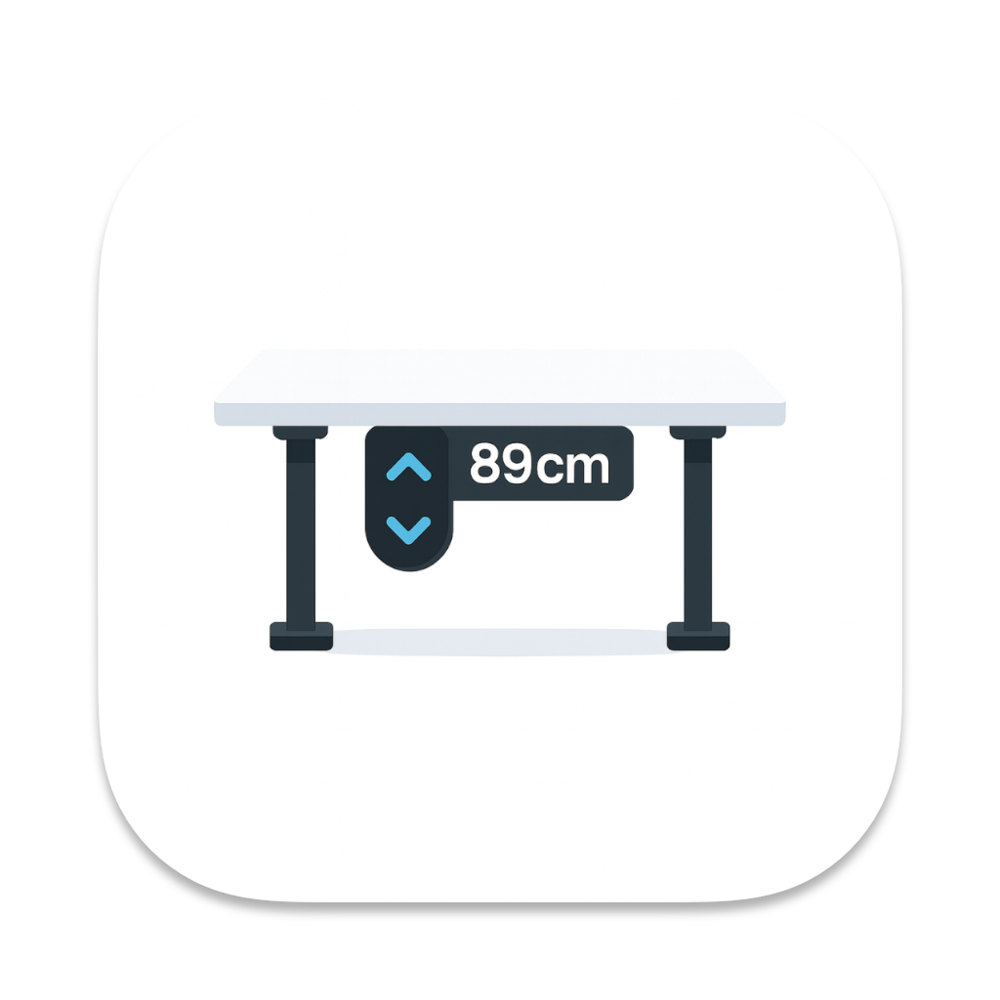

  

<h1 align="center">IKEA Idasen Desk Controller</h1>

A modern, fast and privacy-focused open source controller for the **IKEA Idasen / LINAK** standing desk.  
Powered by **Rust (btleplug)**, **Tauri 2** and **React (Vite + TypeScript)**.

The goal of this project is to build a cross-platform, stable and extensible desktop app that allows fully controlling the Idasen desk from your computer — including target heights, presets, live height reading, logging, menu bar integration and more.

## ✨ Current Features

- Bluetooth Low Energy connection to the IKEA Idasen desk
- Basic **Up** / **Down** movement commands
- Rust backend with **btleplug** BLE stack
- React-based UI prototype
- macOS support with proper Bluetooth permissions & entitlements

---

## 📦 Supported Hardware

This app targets the **IKEA Idasen** sit/stand desk that uses a **LINAK BLE motor controller**.

### ✔ Fully supported

- IKEA Idasen desk models that:

  - Show up in Bluetooth as: `Desk ####` (e.g. `Desk 5440`)
  - Expose LINAK BLE UUIDs in the `99faXXXX-338a-1024-8a49-009c0215f78a` range

- LINAK-based desks that expose the same characteristics:
  - `99fa0002-338a-1024-8a49-009c0215f78a` (movement)
  - `99fa0003-338a-1024-8a49-009c0215f78a` (notifications)
  - `99fa0011-338a-1024-8a49-009c0215f78a` (enable)
  - `99fa0031-338a-1024-8a49-009c0215f78a` (target height, optional)

### ⚠ Planned / partial support

- Other LINAK DL-series desks with compatible BLE controllers
- Third-party LINAK-compatible control boxes that expose similar UUIDs

### ❌ Not supported (for now)

- Desks without Bluetooth
- Controllers that do **not** use the LINAK Desk Control Protocol (DCP)
- Non-LINAK proprietary BLE, UART, RS485 or USB-only controllers

### How to check compatibility

If your desk:

- Shows up as `Desk XXXX` in Bluetooth, **and**
- Exposes at least the `99fa0002-...` movement characteristic

…it is very likely compatible.

You can verify by using `btleplug`, `nRF Connect`, `Bluetooth Explorer` or similar tools to inspect the available GATT services.

---

## 🔍 Technical Background

IKEA Idasen uses a **LINAK Desk Control Protocol (DCP)** over Bluetooth Low Energy.

The controller exposes several GATT characteristics:

| Purpose                  | UUID                                   |
| ------------------------ | -------------------------------------- |
| Move Up / Move Down      | `99fa0002-338a-1024-8a49-009c0215f78a` |
| Height Notifications     | `99fa0003-338a-1024-8a49-009c0215f78a` |
| Enable Desk              | `99fa0011-338a-1024-8a49-009c0215f78a` |
| Target Height (optional) | `99fa0031-338a-1024-8a49-009c0215f78a` |

### Movement command examples

| Action | Bytes (payload) |
| ------ | --------------- |
| UP     | `0x47 0x00`     |
| DOWN   | `0x46 0x00`     |

Some controllers require an **enable** command (e.g. `0x01` written to `99fa0011-...`) before accepting movement commands.

Height notifications are typically sent in **0.1 mm units**; the raw values must be converted accordingly to display centimeters or millimeters.

---

## 🗺️ Roadmap / TODO

### 🔧 Core Functionality

- [ ] Live height reading (via notify characteristic)
- [ ] Set target height (mm/cm input)
- [ ] “Sit / Stand / Custom profiles” with one-click presets
- [ ] Smooth start/stop movement control
- [ ] BLE reconnect without restarting the app
- [ ] Improved error handling and retries
- [ ] Background service for periodic height polling
- [ ] Optional auto-calibration / zeroing workflow

### 🎨 UI / UX Improvements

- [ ] Integrate a UI library (recommended: **Mantine UI**)
- [ ] Add a tabbed interface (e.g. **Status / Controls / Logs / Settings**)
- [ ] Add an in-app log console showing Bluetooth events & errors
- [ ] Better connected / disconnected indicator
- [ ] App icons for macOS / Windows / Linux
- [ ] Better button layout and responsive design
- [ ] Keyboard shortcuts (e.g. `Cmd + ↑` for Up, `Cmd + ↓` for Down)
- [ ] Simple onboarding / first-run hints

### 🖥️ macOS Integration

- [ ] Menu bar / tray mode (control the desk from the status bar)
- [ ] Option to hide the dock icon
- [ ] macOS notifications (“Target height reached”, “Desk disconnected”)
- [ ] Preferences window for app settings
- [ ] Optionally start on login (macOS)

### 📱 Cross-Platform & Mobile

- [ ] Test Windows support (btleplug WinRT backend)
- [ ] Test Linux support (BlueZ backend)
- [ ] iOS app using **Tauri Mobile**
- [ ] Android support via Tauri Mobile or a dedicated mobile client

### 🧩 Integrations & Advanced Features

- [ ] Auto sit/stand cycles (timer / Pomodoro mode)
- [ ] Home Assistant / local API integration
- [ ] Local HTTP or WebSocket API for scripting
- [ ] Config export/import (JSON/YAML)
- [ ] Multiple user profiles (per user height presets)
- [ ] Plugin system for custom automations

### 🧪 Testing

- [ ] BLE abstraction layer for mocking in tests
- [ ] Rust unit tests for desk protocol and commands
- [ ] UI tests with Vitest + React Testing Library
- [ ] Mock/simulated desk backend for development without hardware

---

## ⚙️ Tech Stack

### Backend

- **Rust**
- **Tauri 2**
- **btleplug 0.11** (Bluetooth Low Energy)
- **Tokio** async runtime

### Frontend

- **React 18**
- **Vite**
- **TypeScript**
- UI library: _planned_ (recommended: **Mantine UI**)

### Packaging / App

- macOS `.app` bundle
- `Info.plist` with Bluetooth usage descriptions
- macOS entitlements (`com.apple.security.device.bluetooth`)
- Windows & Linux builds are planned

### 📡 BLE Architecture

React UI (Buttons, quick actions, logs)
│
│ invoke("cmd_up" | "cmd_down" | "check_connection", ...)
▼
Tauri (Rust) Commands
│
│ btleplug: scan, connect, write, subscribe
▼
Bluetooth Low Energy Controller (LINAK)
│
│ GATT services / characteristics (99fa0002, 99fa0003, etc.)
▼
IKEA Idasen / LINAK Desk Hardware

### 📜 License

MIT License
See LICENSE file for details (to be added if not present yet).

### 💡 Motivation

The official desk apps are often limited, slow, or closed.
This project aims to provide a fast, modern, and privacy-friendly controller
for the IKEA Idasen / LINAK desks — running locally, fully under your control,
and built on a strong technical foundation: Rust, Tauri, and React.
